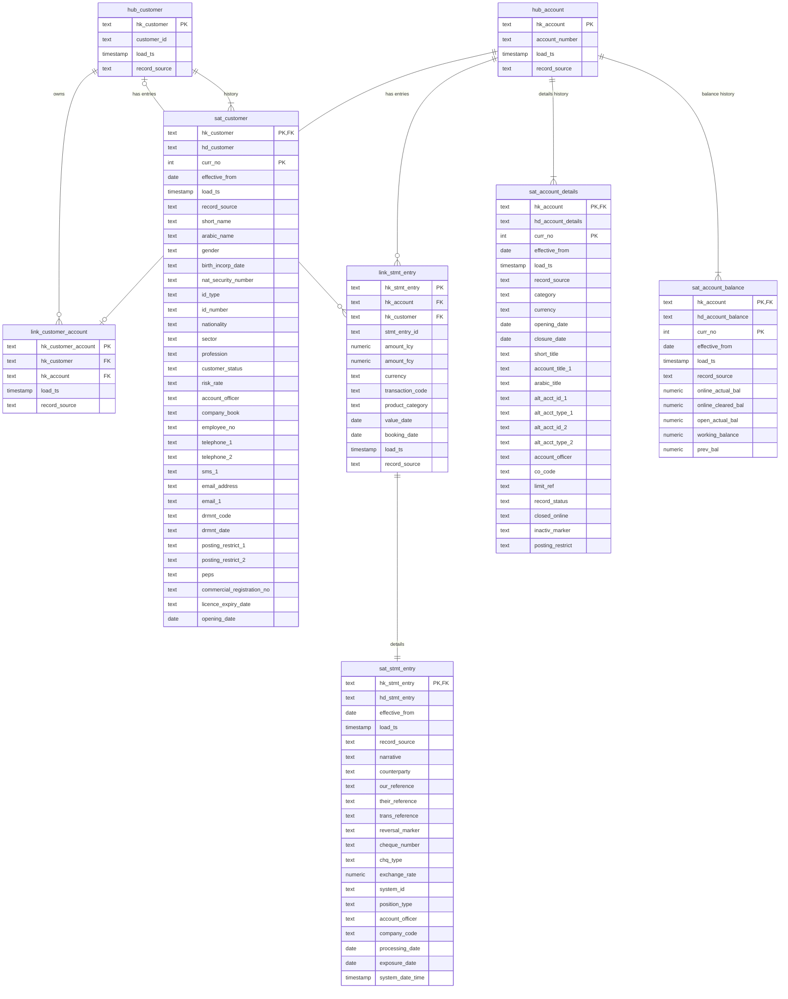

# Silver layer: Raw Vault (Data Vault 2.0)

Schema `dv_raw_vault`. Hubs hold business keys, links hold relationships, satellites hold history.

```mermaid
erDiagram
    hub_customer ||--o{ link_customer_account : "owns"
    hub_account  ||--o| link_customer_account : "owned by"
    hub_account  ||--o{ link_stmt_entry : "has entries"
    hub_customer |o--o{ link_stmt_entry : "has entries"
    hub_customer ||--|{ sat_customer : "history"
    hub_account  ||--|{ sat_account_details : "details history"
    hub_account  ||--|{ sat_account_balance : "balance history"
    link_stmt_entry ||--|| sat_stmt_entry : "details"
    hub_customer {
        text hk_customer PK
        text customer_id
        timestamp load_ts
        text record_source
    }
    hub_account {
        text hk_account PK
        text account_number
        timestamp load_ts
        text record_source
    }
    link_customer_account {
        text hk_customer_account PK
        text hk_customer FK
        text hk_account FK
        timestamp load_ts
        text record_source
    }
    link_stmt_entry {
        text hk_stmt_entry PK
        text hk_account FK
        text hk_customer FK
        text stmt_entry_id
        numeric amount_lcy
        numeric amount_fcy
        text currency
        text transaction_code
        text product_category
        date value_date
        date booking_date
        timestamp load_ts
        text record_source
    }
    sat_customer {
        text hk_customer PK,FK
        text hd_customer
        int curr_no PK
        date effective_from
        timestamp load_ts
        text record_source
        text short_name
        text arabic_name
        text gender
        text birth_incorp_date
        text nat_security_number
        text id_type
        text id_number
        text nationality
        text sector
        text profession
        text customer_status
        text risk_rate
        text account_officer
        text company_book
        text employee_no
        text telephone_1
        text telephone_2
        text sms_1
        text email_address
        text email_1
        text drmnt_code
        text drmnt_date
        text posting_restrict_1
        text posting_restrict_2
        text peps
        text commercial_registration_no
        text licence_expiry_date
        date opening_date
    }
    sat_account_details {
        text hk_account PK,FK
        text hd_account_details
        int curr_no PK
        date effective_from
        timestamp load_ts
        text record_source
        text category
        text currency
        date opening_date
        date closure_date
        text short_title
        text account_title_1
        text arabic_title
        text alt_acct_id_1
        text alt_acct_type_1
        text alt_acct_id_2
        text alt_acct_type_2
        text account_officer
        text co_code
        text limit_ref
        text record_status
        text closed_online
        text inactiv_marker
        text posting_restrict
    }
    sat_account_balance {
        text hk_account PK,FK
        text hd_account_balance
        int curr_no PK
        date effective_from
        timestamp load_ts
        text record_source
        numeric online_actual_bal
        numeric online_cleared_bal
        numeric open_actual_bal
        numeric working_balance
        numeric prev_bal
    }
    sat_stmt_entry {
        text hk_stmt_entry PK,FK
        text hd_stmt_entry
        date effective_from
        timestamp load_ts
        text record_source
        text narrative
        text counterparty
        text our_reference
        text their_reference
        text trans_reference
        text reversal_marker
        text cheque_number
        text chq_type
        numeric exchange_rate
        text system_id
        text position_type
        text account_officer
        text company_code
        date processing_date
        date exposure_date
        timestamp system_date_time
    }
```
